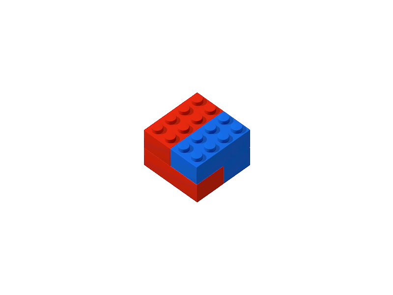

> Repositório dedicado à construção da estrutura para um desafio técnico, focando em conceitos de obsaervability e na abordagem e mentalidade do nosso novo colega de equipe ou como chamamos por aqui, nosso novo conselheiro.

## O que é o La Palma?

O La Palma é um time multidisciplinar, preocupado com a observabilidade dos produtos que provê e mantêm ferramentas e técnicas diferentemente de monitorações isoladas, pontuais ou reativas, nosso time busca ouvir e conectar áreas de funcionalidades e disponibilizar ferramentas escaláveis e reutilizáveis.

**Por que "La Palma"?** La Palma é uma ilha pertencente ao arquipélago das Ilhas Canárias, no Oceano Atlântico, devido à sua localização e suas altas montanhas, a ilha abriga inúmeros observatórios, incluindo o sítio astronômico com a maior concentração de telescópios do Hemisfério Norte.

## A entrevista não é o bastante?

Decidimos criar um desafio não como um teste, mas como um processo de apresentação, a ideia é que, nesta etapa, você entenda um pouco das arquiteturas e estruturas usadas em nossos sistemas e, ao mesmo tempo, possamos ver como você lida com problemas e "pensa" observabilidade. Em resumo, queremos garantir que ambos, empresa e candidato, estejam na mesma página, facilitando a adaptação e aumentando as chances de sucesso.

Para este desafio, sua missão pode ser resumida em 1 tweet:

**Utilizar pelo menos um dos três pilares de observabilidade para criar uma visão da saúde de uma aplicação.** 

---

## O que deve ser entregue?  

**Requisitos Mínimos:** A proposta é que seja apresentada uma arquitetura baseada em ferramentas de observabilidade, nessa entrega a partir de pelo menos um dos três pilares de observabilidade promova uma visão da saúde de uma aplicação simples escrita em python, você pode alterar a linguagem se quiser, desde que, mantenha a funcionalidade atual da aplicação;

Aqui o conceito de saúde é algo que queremos discutir, por isso nada será imposto, você é o arquiteto, e dono do ambiente, então utilize este espaço para mostrar sua ideia de como avaliaria a saúde de uma aplicação, e claro é liberado o uso de mais de um pilar, a criação de alertas, implantação de novos coletores, novas ferramentas a exploração de abordagens conhecidas como Golden Signals, Red Metrics, vale tudo. **sua concepção sobre observabilidade é o que conta.**

## Onde deve ser entregue?  

**Onde posso construir minha solução?** Forneceremos uma conta de testes em um ambiente de nuvem, com algumas limitações, como gestão de IAM e um máximo de 100 dólares de crédito. Mas isso será suficiente, pois o objetivo final não é a complexidade do ambiente entregue, e sim a estratégia e as escolhas na construção.

**Você decide se quer contruir do zero ou partir de nosso modelo:** Optamos por criar uma arquitetura de referência que representa uma amostra do nosso ambiente. Isso facilitará sua compreensão do dia a dia caso você se junte ao time. No entanto, você pode optar por criar sua própria solução, usando as ferramentas que já conhece e mostrando sua visão de observabilidade.

---

## Arquitetura Proposta:  

O ambiente criado para este desafio é composto por uma aplicação Python simples, entregue em uma instância EC2 usando docke compose, a aplicação utiliza o framework flask e está encapsulada em Docker.

Há uma configuração básica para exposição de métricas implementada usando o [prometheus flask exporter](https://pypi.org/project/prometheus-flask-exporter/), essa solução pode ser consultada na pasta [observability/build](https://github.com/timelapalma/desafio/tree/main/observability/build), aqui o uso da linguagem python foi uma escolha arbitraria, queriamos ter um ponto de partida que possibilitasse uma arquitetura simples, e demandasse menos do seu tempo.

---

## Estrutura do ambiente de referência:

Conforme citado para o desafio criamos uma arquitetura simples de referência que utiliza dois Load Balancers respectivamente para aplicação e monitoração e uma instância EC2 com Docker Compose responsável pelos contâiners que compõem a solução, essa arquitetura pode ser entregue em um ambiente de testes na AWS que será fornecido por nós. 

| LoadBalancer | Descrição                                    | Path        | Porta | Função                                                                      |
| -------------|----------------------------------------------|-------------|-------|-----------------------------------------------------------------------------|
| Server       | Endpoint com loadbalancer da aplicação flask | /           | 80    | Aplicação rolar dados, retorna um núm. randômico entre 1 e 6                |
| Server       | Endpoint com loadbalancer da aplicação flask | /metrics    | 80    | Retorna métricas a partir da biblioteca prometheus-flask-exporter           |
| Grafana      | Endpoint com loadbalancer do Grafana         | /           | 80    | Grafana rodando em contêiner com ingestão das métricas da aplicação flask   |

Utilizando o endereço público da instância na AWS também é possível acessar alguns endpoints:

| Descrição                                         | Path        | Porta | Função                                                                                                            |
|----------------------------------------------|-------------|-------|-------------------------------------------------------------------------------------------------------------------|
| Endpoint/porta do node-exporter              | /metrics    | 9100  | node-exporter rodando em contêiner com ingestão das métricas da EC2 que sustenta a stack com grafana e prometheus, enpoint interno acessível dentro da VPC e com as métricas ingeridas no datasource default do grafana |
| Endpoint/porta do cAdvisor                   | /containers | 8080  | cAdvisor rodando em contêiner com ingestão das métricas dos outros componentes da stack, enpoint interno acessível dentro da VPC e com as métricas ingeridas no datasource default do grafana                           |

Caso ocorra alguma dúvida no processo de subida do ambiente, consulte no arquivo [INSTALL.md](https://github.com/timelapalma/desafio/blob/main/INSTALL.md);

---

**___Até o nosso próximo café ou cerveja, onde discutiremos a sua solução**   
